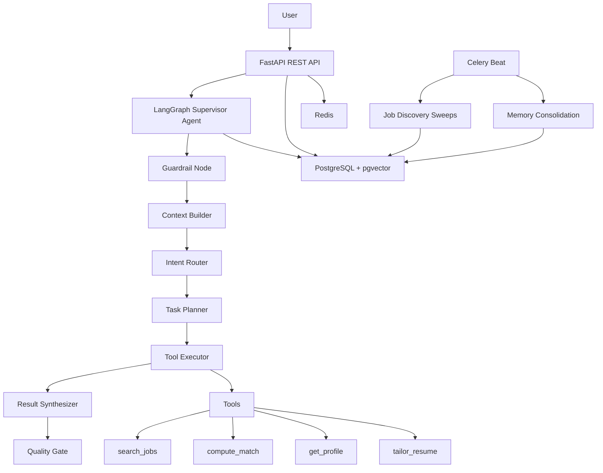

# Pathfinder — Autonomous AI Career Agent

<p align="center">
  <em>An AI agent that works 24/7 on your career — discovering jobs, tailoring resumes, preparing interviews, and learning your preferences over time.</em>
</p>

---

## Overview

Pathfinder is a **production-grade Autonomous AI Career Agent** that helps software engineers, data engineers, and ML engineers throughout their entire job search journey. It is not a chatbot. It is a persistent, proactive career operating system powered by a LangGraph agent, PostgreSQL+pgvector memory, and DeepSeek LLM.

### Key Features

| Capability | Description |
|------------|-------------|
| **Profile Understanding** | Upload resumes in PDF, DOCX, or TXT. AI parses and builds a structured profile with skills, experience, and education. |
| **Continuous Job Discovery** | Automated scrapers for Greenhouse, Y Combinator, and Hacker News "Who's Hiring". Jobs flow into the database hourly. |
| **Semantic Job Matching** | Six-dimension scoring (skills, experience, education, location, preferences, culture) with explainable breakdowns. |
| **Resume Tailoring** | AI rewrites your summary, reorders skills, and optimizes experience bullets for each job. Factuality guard prevents fabrication. |
| **Cover Letter Generation** | Personalized letters with company-specific research and evidence-backed claims. |
| **Application Tracking** | Kanban pipeline from Saved → Applied → Interview → Offer. Status transitions with audit history. |
| **Interview Preparation** | Company-specific interview guides, STAR behavioral questions populated from your actual experience. |
| **Long-Term Memory** | Episodic, semantic, and procedural memory. The agent learns your preferences and career patterns over months. |
| **Knowledge Retrieval (RAG)** | Upload documents, job descriptions, and notes. Hybrid vector+keyword search retrieves relevant context. |
| **Proactive Agent** | LangGraph Supervisor agent with 7 tools. Intent routing, task planning, and multi-step workflow execution. |

---

## Architecture



## Technology Stack

| Layer | Technology |
|-------|-----------|
| **Language** | Python 3.12+ |
| **API Framework** | FastAPI + Uvicorn |
| **Agent Framework** | LangGraph (StateGraph with PostgresSaver) |
| **LLM** | DeepSeek API (with circuit breaker and graceful degradation) |
| **Database** | PostgreSQL 16 + pgvector (HNSW indexes) |
| **Cache/Queue** | Redis 7 |
| **Background Tasks** | Celery + Celery Beat |
| **Container** | Docker + Docker Compose |
| **Monitoring** | Prometheus metrics, structlog JSON logging, Sentry error tracking |

---

## Agent Architecture

The Supervisor Agent is a LangGraph StateGraph with 7 nodes:

```
guardrail → context_builder → intent_router → task_planner → tool_executor → result_synthesizer → quality_gate
```

**7 Tools Available:**
`search_jobs`, `get_job_detail`, `compute_match`, `get_recommendations`, `get_profile`, `get_resumes`, `tailor_resume`

The agent understands 11 intents, classifies via LLM, plans multi-step execution, and falls back to deterministic plans when LLM is unavailable. Memory context is injected at every node for personalization.

---

## Memory System

Three memory types power personalization:

| Type | Storage | Purpose |
|------|---------|---------|
| **Episodic** | PostgreSQL (partitioned daily) | Raw event log — agent executions, feedback, profile changes |
| **Semantic** | PostgreSQL + pgvector HNSW | Structured facts — "User prefers remote fintech roles" |
| **Procedural** | PostgreSQL | Behavioral patterns — learned workflows (V1) |

**Consolidation:** Daily Celery job processes unconsolidated episodes → LLM extracts facts, preferences, and patterns → upserts into semantic memory. Agent context builder loads recent episodes + vector-searched semantic memories on every invocation.

---

## Knowledge/RAG System

Document ingestion pipeline:
```
Upload → Extract text → Semantic chunking → DeepSeek embedding → pgvector HNSW store
```

Hybrid retrieval:
```
Query → Vector search (cosine) + Keyword search (tsvector GIN) → Weighted fusion → Re-ranked results
```

---

## Job Discovery Pipeline

Three automated scrapers run hourly via Celery Beat:

| Source | Type | Coverage |
|--------|------|----------|
| **Greenhouse** | 34 company boards | Stripe, Airbnb, Figma, Notion, Datadog, etc. |
| **Y Combinator** | Startup job board | All YC-backed startups |
| **Hacker News** | Community | Monthly "Who's Hiring" thread |

Jobs flow through: Scrape → Normalize → Deduplicate → Enrich → Store → Search.

---

## Resume Tailoring Engine

Multi-stage pipeline with anti-hallucination guardrails:

1. **Keyword Extraction** — Regex-based extraction from job description (no LLM dependency)
2. **Summary Rewrite** — LLM rewrites professional summary for job alignment
3. **Skills Reorder** — Deterministic reordering by JD keyword priority
4. **Experience Rewrite** — LLM optimizes bullet points for relevance
5. **Factuality Guard** — Post-generation LLM verification. Every claim checked against profile. Score 0-1.

All stages gracefully degrade without DeepSeek.

---

## Application Tracking

Kanban pipeline with strict status transitions:

```
Saved → Applied → Phone Screen → Technical Interview → Onsite → Offer → Accepted
```

Status history is versioned. Duplicate application prevention. Pipeline summary analytics.

---

## Local Setup

```bash
git clone https://github.com/pathfinder/pathfinder.git
cd pathfinder
cp .env.example .env  # Edit with your DeepSeek API key
docker compose up -d
alembic upgrade head
```

API available at `http://localhost:8000`. Swagger docs at `/docs`.

## Deployment

```bash
docker compose -f docker-compose.prod.yml up -d
```

Requires: PostgreSQL 16 + pgvector, Redis 7, DeepSeek API key, JWT RSA key pair.

See [DEPLOYMENT.md](DEPLOYMENT.md) for full guide.

## API Overview

| Group | Endpoints | Description |
|-------|-----------|-------------|
| Auth | 3 | Register, login, logout with JWT |
| Profile | 6 | Resume upload, profile CRUD, resume management |
| Tailoring | 5 | Analyze, tailor, version, compare, accept |
| Jobs | 4 | Search, filter, company lookup |
| Matching | 2 | 6-dimension scoring, feedback |
| Agent | 3 | Execute with SSE streaming, execution history |
| Knowledge | 4 | Ingest documents, hybrid search |
| Applications | 5 | CRUD with status transitions |
| Health | 3 | Live, ready, detailed |
| Metrics | 1 | Prometheus endpoint |

Full API specification: [API.md](API.md)

---

## Roadmap

| Phase | Timeline | Focus |
|-------|----------|-------|
| **v0.1** | Current | Private alpha. Core loop functional. |
| **v0.2** | +2 weeks | CI/CD pipeline, load testing, partitioning. |
| **v1.0** | +2 months | Public beta. Cover letters, interview prep, career coach. |
| **v2.0** | +6 months | Autopilot mode, mobile apps, enterprise dashboard. |

---

## License

MIT

---

<p align="center">
  <em>Built with ❤️ by the Pathfinder Engineering Team</em>
</p>
