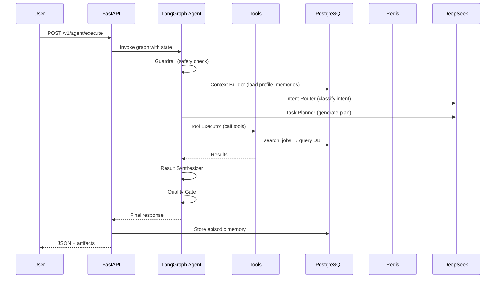
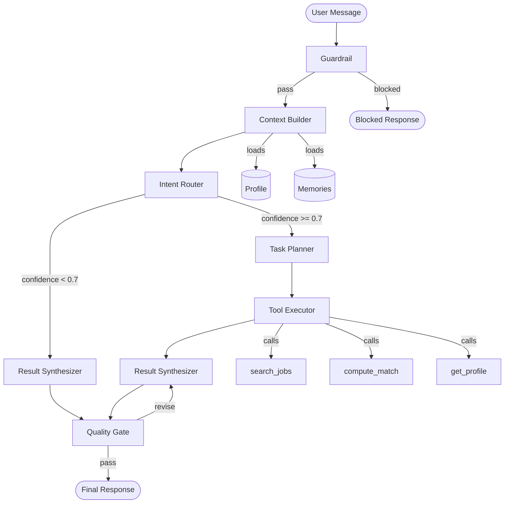
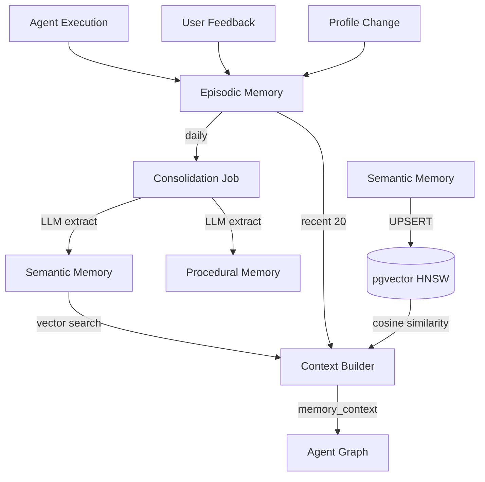
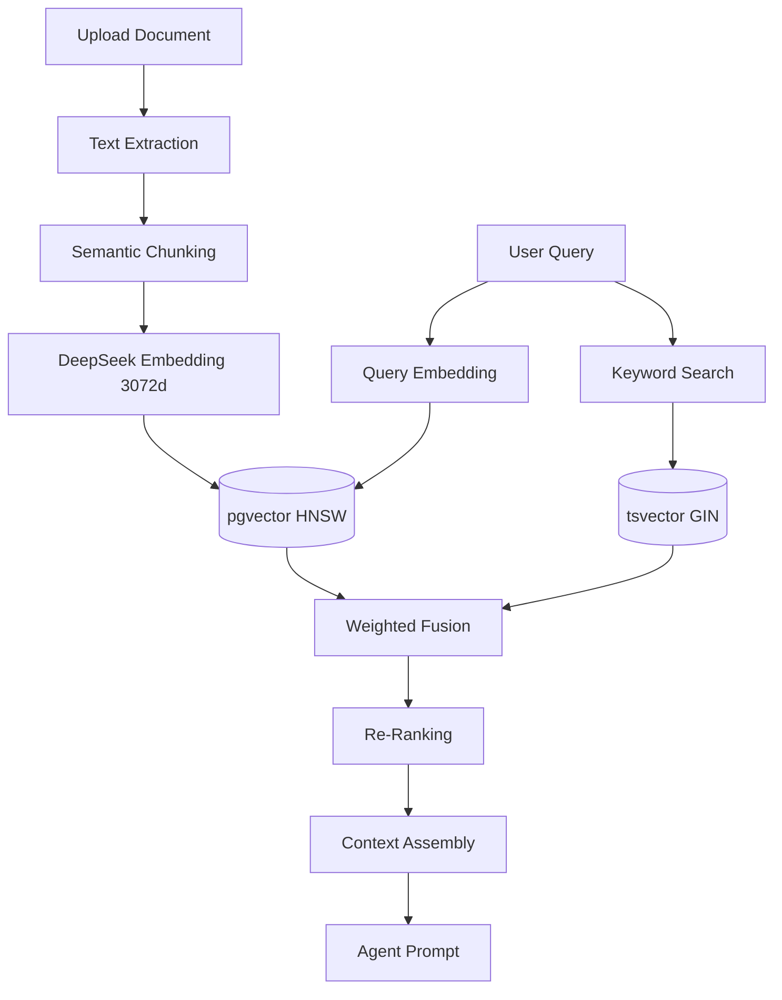
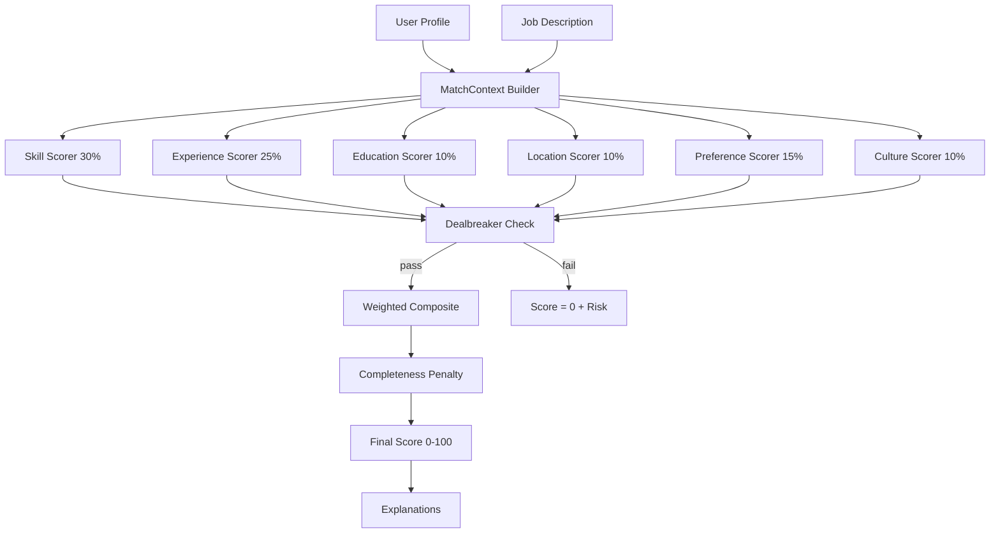

# Pathfinder — System Diagrams

## End-to-End Flow

```mermaid
sequenceDiagram
    participant U as User
    participant A as FastAPI
    participant G as LangGraph Agent
    participant T as Tools
    participant D as PostgreSQL
    participant R as Redis
    participant L as DeepSeek

    U->>A: POST /v1/agent/execute
    A->>G: Invoke graph with state
    G->>G: Guardrail (safety check)
    G->>D: Context Builder (load profile, memories)
    G->>L: Intent Router (classify intent)
    G->>L: Task Planner (generate plan)
    G->>T: Tool Executor (call tools)
    T->>D: search_jobs → query DB
    T-->>G: Results
    G->>G: Result Synthesizer
    G->>G: Quality Gate
    G-->>A: Final response
    A->>D: Store episodic memory
    A-->>U: JSON + artifacts
```

## Agent Workflow

```mermaid
graph TD
    Start([User Message]) --> G[Guardrail]
    G -->|pass| CB[Context Builder]
    G -->|blocked| End1([Blocked Response])
    CB --> IR[Intent Router]
    IR -->|confidence >= 0.7| TP[Task Planner]
    IR -->|confidence < 0.7| RS1[Result Synthesizer]
    TP --> TE[Tool Executor]
    TE --> RS2[Result Synthesizer]
    RS1 --> QG[Quality Gate]
    RS2 --> QG
    QG -->|pass| End2([Final Response])
    QG -->|revise| RS2

    CB --> |loads| P[(Profile)]
    CB --> |loads| M[(Memories)]
    TE --> |calls| T1[search_jobs]
    TE --> |calls| T2[compute_match]
    TE --> |calls| T3[get_profile]
```

## Memory Flow

```mermaid
graph TD
    E[Agent Execution] --> EM[Episodic Memory]
    F[User Feedback] --> EM
    P[Profile Change] --> EM

    EM --> |daily| C[Consolidation Job]
    C --> |LLM extract| SM[Semantic Memory]
    C --> |LLM extract| PM[Procedural Memory]

    SM --> |vector search| CB[Context Builder]
    EM --> |recent 20| CB
    CB --> |memory_context| AG[Agent Graph]

    SM2[Semantic Memory] --> |UPSERT| V[(pgvector HNSW)]
    V --> |cosine similarity| CB
```

## RAG Flow

```mermaid
graph TD
    U[Upload Document] --> EX[Text Extraction]
    EX --> CH[Semantic Chunking]
    CH --> EM[DeepSeek Embedding 3072d]
    EM --> VS[(pgvector HNSW)]

    Q[User Query] --> QE[Query Embedding]
    QE --> VS
    Q --> KW[Keyword Search]
    KW --> TS[(tsvector GIN)]

    VS --> M[Weighted Fusion]
    TS --> M
    M --> RR[Re-Ranking]
    RR --> CA[Context Assembly]
    CA --> AG[Agent Prompt]
```

## Matching Workflow

```mermaid
graph TD
    P[User Profile] --> MC[MatchContext Builder]
    J[Job Description] --> MC

    MC --> S1[Skill Scorer 30%]
    MC --> S2[Experience Scorer 25%]
    MC --> S3[Education Scorer 10%]
    MC --> S4[Location Scorer 10%]
    MC --> S5[Preference Scorer 15%]
    MC --> S6[Culture Scorer 10%]

    S1 --> DB[Dealbreaker Check]
    S2 --> DB
    S3 --> DB
    S4 --> DB
    S5 --> DB
    S6 --> DB

    DB -->|pass| WS[Weighted Composite]
    DB -->|fail| ZS[Score = 0 + Risk]

    WS --> CP[Completeness Penalty]
    CP --> FS[Final Score 0-100]
    FS --> EX[Explanations]
```
